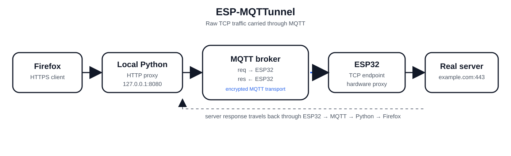

[🇺🇸 English](README.md)  [🇨🇳 中文](README.zh.md)  [🇷🇺 русский](README.ru.md)  [🇮🇳 हिंदी](README.hi.md)  [🇪🇸 español](README.es.md) 
<p align="center">
  
  <h1 align="center">ESP-MQTTunnel <br>
	  
	  
	  
	  
  </h1>
</p>
	


这是一个可实际运行的概念验证项目，能将 ESP32 变成一个成本仅 3 美元的硬件代理，通过 MQTT 协议隧道传输流量。由于它主动连接至代理服务器（Broker），因此无需开放端口或拥有公网 IP 即可绕过网络审查。

---

## 工作原理

ESP32 充当实际的 TCP 端点，而运行在笔记本电脑上的 Python 脚本则作为本地代理。MQTT 仅作为两者之间的通信通道。

测试环境：Windows 10 (Firefox / Python 3) <--> ESP32-S3 开发板 <--> HiveMQ Cloud（免费层级）
> ⚠️ 笔记本电脑所在的国家/地区必须能够访问该 MQTT 代理服务器（Broker）。
---
## 确认有效

- ✅ YouTube
- ✅ Gmail
- ✅ Twitter / X
- ✅ News sites
- ✅ Reddit

## 已知问题

- ❌ Instagram 卡顿
---## 工作原理

1. **ESP32** 连接到 Wi-Fi 并订阅 MQTT 的 `req` 主题。
2. **Python 脚本** 在笔记本电脑上运行一个本地 HTTP 代理（例如 `127.0.0.1:8080`）。
3. 配置 Firefox 使用该本地代理。
4. 当 Firefox 请求某个网站时，Python 代理会：
- 解析 `CONNECT host:port` 行。 
- 通过 MQTT 发布一条 `open` 消息。 
- 将原始 TLS 字节流作为 `data` 消息进行传输。
5. ESP32 接收这些消息，向目标主机建立真实的 TCP 套接字连接，并转发这些字节。
6. 来自真实服务器的响应通过 MQTT（`res` 主题）传回，由 Python 代理接收，并写回给 Firefox。

---

## 注意事项

- 所有流量均以**原始（raw）**形式转发——不进行 TLS 拦截，也不进行解密。
- 这是一个概念验证（PoC）项目，并非经过安全加固的生产级代理。在高并发负载下，可能会出现不稳定或性能问题。

---

## 局限性

ESP32 的**资源有限且不支持多线程**，因此无法处理过多的并发连接。尝试在多个标签页中加载页面将无法正常工作。

图片和视频*可以*正常加载，但为了节省带宽（尤其是使用免费 MQTT 账户时）并提高速度，建议在 Firefox 中使用内容拦截插件，例如 **Block Image Reloaded**。

---

## 使用方法

### 1. MQTT 代理服务器 (Broker)

在 [HiveMQ Cloud](https://www.hivemq.com/mqtt-cloud-broker/) 创建一个免费集群（或者使用任何两台设备都能访问的 MQTT 代理服务器）。请记录以下信息：
- 主机名 (Hostname)
- 端口 (Port，TLS 通常为 `8883`)
- 用户名 (Username)
- 密码 (Password)

### 2. 配置凭证

编辑这两个文件并设置您的 MQTT 凭证：

**`server.py`**
```python
broker = "your-cluster-id.s1.eu.hivemq.cloud"
user   = "your-username"
pw     = "your-password"
```
**`esp.ino`**
```c
const char* ssid    = "your-wifi-ssid";
const char* pass    = "your-wifi-password";
const char* broker  = "your-cluster-id.s1.eu.hivemq.cloud";
const char* user    = "your-username";
const char* mpass   = "your-password";
```

### 3. 烧录 ESP32

在 Arduino IDE 中打开 `esp.ino`，选择您的 ESP32 开发板，然后进行上传。打开串口监视器（波特率设为 115200）以查看运行状态。我更喜欢使用 PuTTY，因为它方便复制大量的输出信息。

### 4. 运行 Python 代理服务器

```
pip install paho-mqtt
python server.py
```

您应该会看到以下输出：

```
Listening on 127.0.0.1:8080
Set Firefox HTTPS proxy to 127.0.0.1:8080
Press Ctrl+C to stop
```

### 5. 将 Firefox 指向该代理

在 Firefox 中：

1. 进入 设置 (Settings) → 常规 (General) → 网络设置 (Network Settings) → 设置… (Settings…)

2. 选择 手动代理配置 (Manual proxy configuration)

3. 将 HTTPS 代理设置为 `127.0.0.1`，端口设为 `8080`

4. 确保 `localhost` 和 `127.0.0.1` 不在“不使用代理 (No proxy for)”列表中

5. 点击 确定 (OK)

访问任意 HTTPS 网站。流量将通过 MQTT 转发至 ESP32，再由其发送到目标服务器。

### MQTT 主题 (Topics)
|主题 (Topic)|方向 (Direction)|用途 (Purpose)|
|---|---|---| |req|Python → ESP32|客户端至服务器的字节数据（open、data、close）|
|res|ESP32 → Python|服务器至客户端的字节数据（data）|


### 消息格式

## 所有 MQTT 消息均为 JSON 格式：

```json

{
"conn_id": 5,
"host": "www.example.com",
"port": 443,
"type": "data",
"data": "FgMBB2ABAAdc..."
}
```

- type（类型）为 open、data 或 close 之一

- data（数据）为 Base64 编码的原始字节数据；对于 open 或 close 类型，该字段为 null

- conn_id 用于标识 TCP 连接（Firefox 会并行建立多个连接）
