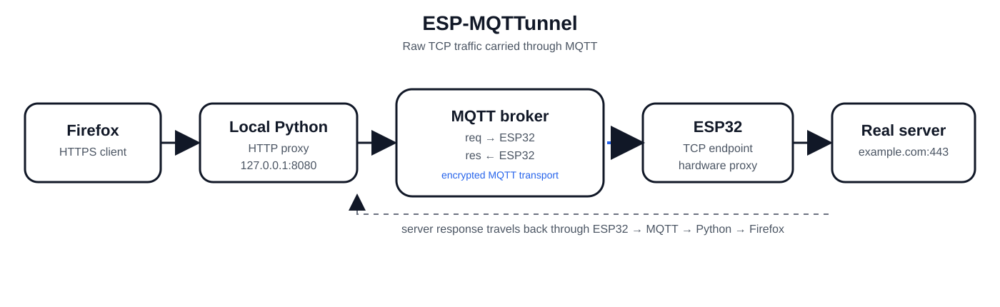

[🇺🇸 English](README.md)  [🇨🇳 中文](README.zh.md)  [🇷🇺 русский](README.ru.md)  [🇮🇳 हिंदी](README.hi.md)  [🇪🇸 español](README.es.md)
<p align="center">
<h1 align="center">ESP-MQTTunnel <br>


</h1>
</p>


Рабочий прототип (PoC), превращающий ESP32 в аппаратный прокси-сервер, который туннелирует трафик через MQTT. Поскольку устройство инициирует исходящее соединение с брокером, можно обходить брандмауэры и цензуру без открытия портов или наличия публичного IP-адреса. Весь трафик передается в **«сыром» виде** (raw) — без перехвата TLS и без расшифровки.

---

## Принцип работы

Вот пример, демонстрирующий работу системы (технические подробности приведены ниже). Цель проекта — обход интернет-ограничений.

**Локация A:** Страна с жесткой интернет-цензурой или строгими ограничениями. Ноутбук с Windows 10, браузером Firefox и локальным прокси-сервером на Python.

**Локация B:** Свободный интернет без цензуры. Здесь подключен ESP32.

**Локация C:** MQTT-сервер — он должен быть доступен из точек A и B, но не обязательно должен находиться в зоне свободного интернета. (определение: MQTT (Message Queuing Telemetry Transport) — это легковесный протокол обмена сообщениями с открытым стандартом, разработанный для устройств с ограниченными ресурсами и работы в ненадежных сетях)

1. Браузер на ноутбуке пытается получить доступ к заблокированному сайту и отправляет запрос локальному Python-прокси, который пересылает его на MQTT-сервер.
2. ESP32 считывает байты с MQTT-сервера и пересылает их на заблокированный сайт, который обычно недоступен из точки A.
3. ESP32 получает ответ от сайта и отправляет его на MQTT-сервер.
4. Ноутбук в точке A считывает ответ от заблокированного сайта и (с помощью Python) отображает его в браузере.


Проверено на: Windows 10 Firefox / Python 3 <--> ESP32-S3 Dev Module <--> HiveMQ Cloud (бесплатный тариф)
> ⚠️ MQTT-брокер должен быть доступен из той страны, где находится ноутбук.
---

## Подтверждена работа с

- YouTube
- Gmail
- Twitter / X
- Новостные сайты
- Reddit
- Google, DuckDuckGo и т. д.

## Известные проблемы

- Instagram зависает
---
## Принцип работы

1. **ESP32** подключается к Wi-Fi и подписывается на MQTT-топик `req`.
2. **Python-скрипт** запускает локальный HTTP-прокси на ноутбуке (например, `127.0.0.1:8080`).
3. Firefox настраивается на использование этого локального прокси.
4. Когда Firefox запрашивает сайт, Python-прокси:
- Разбирает строку `CONNECT host:port`. 
- Публикует сообщение `open` через MQTT. 
- Передает «сырые» TLS-байты в виде сообщений `data`.
5. ESP32 получает эти сообщения, открывает реальный TCP-сокет к целевому хосту и пересылает байты.
6. Ответы от реального сервера возвращаются через MQTT (топик `res`), принимаются Python-прокси и передаются обратно в Firefox. ---

## Ограничения

У ESP32 **ограниченные ресурсы**, поэтому она не может обрабатывать слишком много одновременных подключений. Попытка загрузить страницы в нескольких вкладках одновременно не сработает.

Изображения и видео *работают*, но для экономии трафика (особенно при использовании бесплатного аккаунта MQTT) и повышения скорости рекомендуется использовать блокировщик контента, например **Block Image Reloaded** в браузере Firefox.

---

## Использование

### 1. MQTT-брокер

Создайте бесплатный кластер на [HiveMQ Cloud](https://www.hivemq.com/mqtt-cloud-broker/) (или используйте любой другой MQTT-брокер, доступный с обоих устройств).

Запишите следующие данные:
- Имя хоста (Hostname)
- Порт (обычно `8883` для TLS)
- Имя пользователя
- Пароль

### 2. Настройка учетных данных

Отредактируйте оба файла и укажите свои учетные данные для MQTT:

**`server.py`**
```python
broker = "your-cluster-id.s1.eu.hivemq.cloud"
user   = "your-username"
pw     = "your-password"
```
**`esp.ino`**
```c
const char* ssid    = "your-wifi-ssid";
const char* pass    = "your-wifi-password";
const char* broker  = "your-cluster-id.s1.eu.hivemq.cloud";
const char* user    = "your-username";
const char* mpass   = "your-password";
```

### 3. Прошивка ESP32

Откройте файл `esp.ino` в Arduino IDE, выберите вашу плату ESP32 и загрузите прошивку. Откройте монитор последовательного порта (Serial Monitor) со скоростью 115200 бод, чтобы наблюдать за работой устройства. Я предпочитаю использовать PuTTY, так как это позволяет копировать большие объемы выводимых данных.

### 4. Запустите прокси-сервер на Python

```
pip install paho-mqtt
python server.py
```

Вы должны увидеть следующее:

```
Listening on 127.0.0.1:8080
Set Firefox HTTPS proxy to 127.0.0.1:8080
Press Ctrl+C to stop
```

### 5. Настройте Firefox на использование прокси

В Firefox:

1. Перейдите в Настройки → Основные → Параметры сети → Настроить…

2. Выберите «Ручная настройка прокси»

3. Установите HTTPS-прокси: 127.0.0.1, порт 8080

4. Убедитесь, что localhost и 127.0.0.1 отсутствуют в списке исключений («Не использовать прокси для»)

5. Нажмите OK

Зайдите на любой HTTPS-сайт. Трафик будет передаваться через MQTT на ESP32, а затем — на реальный сервер.

### MQTT-топики
|Топик|Направление|Назначение|
|---|---|---|
|req|Python → ESP32
